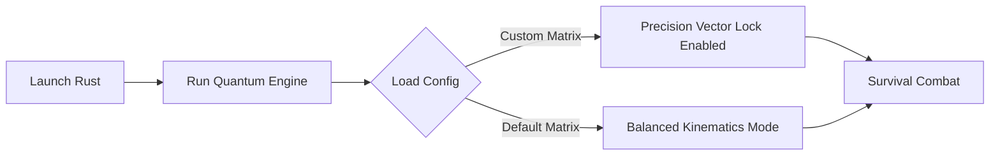

> **Legal & Educational Disclaimer:** *This repository is maintained strictly for academic research, human-computer interaction analysis, and system accessibility purposes. It does not manipulate game memory, alter internal game files, or inject unauthorized code into any active game client. Users are responsible for complying with local platform End User License Agreements (EULA).*

---

<!-- ПЛЕЙСХОЛДЕР ДЛЯ ВАШЕГО СКРИНШОТА ИНТЕРФЕЙСА -->

  

## ⚙️ Workflow Diagram

# Rust-Quantum-v2-Next-Gen-AI-Assistant — Advanced AI Training Platform & Vision Assistant

  <!-- Кликабельные кнопки (Оранжевый индустриальный стиль) -->
  
  

  
  
  

---

**Rust-Quantum-v2-Next-Gen-AI-Assistant** is a cutting-edge, external training utility and visual guidance platform engineered for dynamic multiplayer survival environments. Utilizing local neural networks and real-time computer vision models, the system analyzes desktop pixel streams to enhance situational awareness, tactical reaction matrices, and crosshair alignment. By operating entirely from outside the target client environment and executing zero active process interactions, it provides mathematical aiming and recoil compensation support with absolute integrity.

---

## ⚙️ System Deployment Controls

1. **Download the Core:** Retrieve the compiled AI assistant framework package from the releases section above.
2. **Extraction:** Unpack the compressed archive structure into your preferred workspace directory via *7-Zip* or *WinRAR*.
3. **Model Calibration:** Launch the executive runtime engine as Administrator to initialize the neural network weights, configuration matrices, and GPU hardware acceleration.
4. **Environment Boot:** Start your survival simulation game client and set your video display mode to *Borderless Windowed*.
5. **Real-Time Tuning:** Use the stream-safe overlay configuration menu (default hotkey: `Insert`) to instantly adjust recognition confidence thresholds, detection zones, and humanized smoothing filters.

---

## Neural Network & Vision Capabilities

| Category | System Modules | Technology Overview |
| :--- | :--- | :--- |
| **Vision Guidance** | Real-Time Object Detection | Advanced convolutional models scan screen matrices to automatically detect opponent model vectors (head, chest) in milliseconds amidst dense foliage and environmental clutter. |
| **Reflex Matrix** | Intelligent Micro-Reaction | High-frequency analysis engine calculates structural target movement tracking and triggers automatic coordinate micro-adjustments with humanized click variance. |
| **Humanized Filters** | Dynamic Vector Smoothing | Advanced Bezier curve mathematics apply realistic inertia and weight to cursor movements, perfectly mirroring the organic muscle memory of elite players. |
| **Sensory UI** | Stream-Proof FOV Overlay | Lightweight vector bounding box visualization and field-of-view ($R_{fov}$) zoning, allowing you to track exactly where the AI neural engine is focused. |

---

## Non-Invasive Safety & Zero-Ban Architecture

* **`[ZERO PROCESS INTERACTION]`** — The software relies exclusively on Windows Desktop API pixel capture. It does not open game handles, read runtime memory lines, or hook execution engine functions.
* **`[ANTI-HEURISTIC PASSIVE]`** — Completely bypasses client-side telemetry systems. Because no code is injected into the application environment, the software cannot be detected by traditional system signature scanners.
* **`[LOCAL HARDWARE COMPILATION]`** — The neural network trains, loads, and operates strictly on your local GPU (CUDA/DirectX), keeping your usage data private and completely decentralized.
* **`[OPTIMIZED YOLO FRAMEWORK]`** — Employs custom micro-architectures that deliver lightning-fast inference times (<2ms) without reducing your active in-game frame rate (FPS).

---

## Tactical Application Profiles

* **Reflex Skill Building:** Sharpen your holding angles, recoil control patterns, and flick mechanics against fast-moving targets under simulated high-pressure combat scenarios.
* **Competitive Training:** Maintain optimal crosshair placement, bullet drop compensation, and active target tracking during intense close-quarters encounters or base defense phases.
* **Stream-Safe Performance:** Stream or capture your gameplay seamlessly — the AI overlay operates on an independent desktop rendering layer hidden from capturing software like OBS and Discord.

---

<code>[Q]</code> <code>[U]</code> <code>[A]</code> <code>[N]</code> <code>[T]</code> <code>[U]</code> <code>[M]</code> <code>[V]</code> <code>[2]</code> — ⚡ A I . S Y N C E D .

---

computer-vision, object-detection, pytorch, survival-games, yolov8, cuda-acceleration, easports-analytics, real-time-processing, spatial-analysis, recoil-compensation

<!-- update: A -->